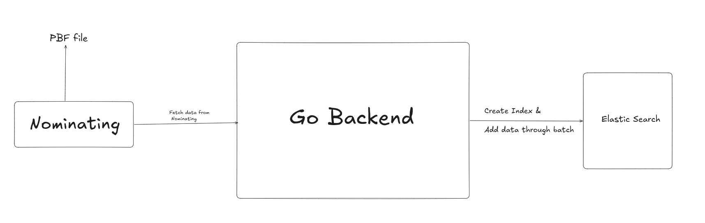
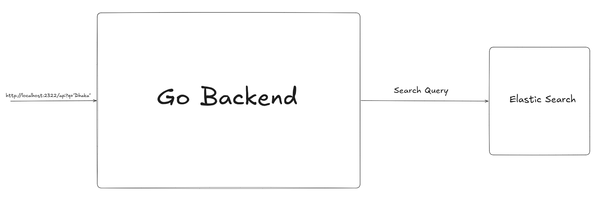

# Search Schema Design & Mappings Documentation

## Overview

This document describes the Elasticsearch schema design and mapping configuration for the Place Search service. The schema is optimized for **search-as-you-type** functionality with **fuzzy matching** capabilities to handle typos and partial queries.

## Table of Contents

1. [Index Mapping Structure](#index-mapping-structure)
2. [Field Types & Rationale](#field-types--rationale)
3. [Search-as-You-Type Field](#search-as-you-type-field)
4. [Query Strategy](#query-strategy)
5. [Performance Optimizations](#performance-optimizations)
6. [Data Model](#data-model)

---

## Index Mapping Structure


We use pbf (OSM PBF) data to index place names and geographic information.
At first we download the pbf file and then we use nominatim to extract the data from the pbf file.
The nominatim extracts the data from the pbf file and then we use the data to index the data in elasticsearch.



### Complete Mapping Definition

```json
{
  "mappings": {
    "properties": {
      "name":        {"type": "search_as_you_type"},
      "coordinate":  {"type": "geo_point",  "index": false},
      "osm_id":      {"type": "long",       "index": false},
      "osm_type":    {"type": "keyword",    "index": false},
      "osm_key":     {"type": "keyword",    "index": false},
      "osm_value":   {"type": "keyword",    "index": false},
      "type":        {"type": "keyword",    "index": false},
      "country":     {"type": "keyword",    "index": false},
      "countrycode": {"type": "keyword",    "index": false},
      "state":       {"type": "keyword",    "index": false},
      "county":      {"type": "keyword",    "index": false},
      "city":        {"type": "keyword",    "index": false},
      "district":    {"type": "keyword",    "index": false},
      "locality":    {"type": "keyword",    "index": false},
      "street":      {"type": "keyword",    "index": false},
      "postcode":    {"type": "keyword",    "index": false},
      "extent":      {"type": "object",     "enabled": false}
    }
  }
}
```
Here we made the name field as search_as_you_type field. 
search_as_you_type is a field type that is optimized for autocomplete. It automatically creates multiple subfields optimized for autocomplete.
The other fields are keyword fields. Inverted index is disabled for these fields.

**Auto-generated subfields:**
- `name` (root field) - Standard text analysis
- `name._2gram` - 2-word shingles (for multi-word phrases)
- `name._3gram` - 3-word shingles (for multi-word phrases)
- `name._index_prefix` - Edge n-grams of the last term (for prefix matching)


**Example (single word):**
```
Input: "Dhaka"
Indexed as:
  - name: "dhaka" (lowercased, analyzed)
  - name._2gram: ["dhaka"]
  - name._3gram: ["dhaka"]
  - name._index_prefix: ["d", "dh", "dha", "dhak", "dhaka"]
```

**Example (multi-word):**
```
Input: "Dhaka City"
Indexed as:
  - name: ["dhaka", "city"]
  - name._2gram: ["dhaka city", "dhaka", "city"]
  - name._3gram: ["dhaka city"]
  - name._index_prefix: ["c", "ci", "cit", "city"] (prefix of last term)

### Implementation Location

- **File:** `internal/infrastructure/elasticsearch/index_manager.go`
- **Function:** `CreateIndex()`
- **Index Name:** Configurable via `config.yaml` (default: `places`)
```

#### Address Hierarchy Fields (keyword)

---

## Search-as-You-Type Field

### How `search_as_you_type` Works

The `search_as_you_type` field type is a specialized Elasticsearch field optimized for autocomplete and prefix matching.

#### Internal Structure

When you index a document with `name: "Dhaka"`, Elasticsearch creates:

```
Root field (name):
  - Analyzer: standard
  - Tokens: ["dhaka"]

Subfield (name._2gram):
  - Analyzer: shingle (2-word combinations)
  - Tokens: ["dhaka"] (single word, no shingles)

Subfield (name._3gram):
  - Analyzer: shingle (3-word combinations)
  - Tokens: ["dhaka"] (single word, no shingles)

Subfield (name._index_prefix):
  - Analyzer: edge_ngram on last term
  - Tokens: ["d", "dh", "dha", "dhak", "dhaka"]
```

**For multi-word example `"Dhaka City"`:**

```
Root field (name):
  - Tokens: ["dhaka", "city"]

Subfield (name._2gram):
  - Tokens: ["dhaka city", "dhaka", "city"] (2-word shingles)

Subfield (name._3gram):
  - Tokens: ["dhaka city"] (3-word shingles, only 2 words available)

Subfield (name._index_prefix):
  - Tokens: ["c", "ci", "cit", "city"] (prefix of LAST term only)
```


---

## Query Strategy

### Dual-Clause Boolean Query

The search uses a `bool/should` query combining two complementary strategies:

```json
{
  "query": {
    "bool": {
      "should": [
        {
          "multi_match": {
            "query": "dhka",
            "type": "bool_prefix",
            "fields": [
              "name",
              "name._2gram",
              "name._3gram",
              "name._index_prefix"
            ]
          }
        },
        {
          "match": {
            "name": {
              "query": "dhka",
              "fuzziness": "AUTO"
            }
          }
        }
      ]
    }
  }
}
```

### Clause 1: Multi-Match Bool Prefix

**Purpose:** Autocomplete and prefix matching

**Type:** `bool_prefix`

**Fields:** All `search_as_you_type` subfields

**Behavior:**
- Treats query as prefix search
- Searches across all n-gram subfields

**Example:**
```
Query: "dha"
Matches: "Dhaka", "Dhanbari", "Dharampur"
Reason: All start with "dha"
```

### Clause 2: Fuzzy Match

**Purpose:** Typo tolerance

**Type:** `match` with `fuzziness: AUTO`

**Field:** `name` (root field only)

**Fuzziness levels (AUTO):**
- 0-2 characters: No fuzziness (exact match)
- 3-5 characters: Edit distance of 1
- 6+ characters: Edit distance of 2

**Example:**
```
Query: "dhka" (typo - missing 'a')
Matches: "Dhaka"
Reason: Edit distance of 1 (insert 'a')
```

### Configuration

**File:** `config.yaml`

```yaml
search:
  min_chars: 2        # Minimum query length
  fuzziness: AUTO     # AUTO, 0, 1, 2
  max_results: 15     # Result limit
```

**Implementation:** `internal/infrastructure/elasticsearch/query_builder.go`

---


